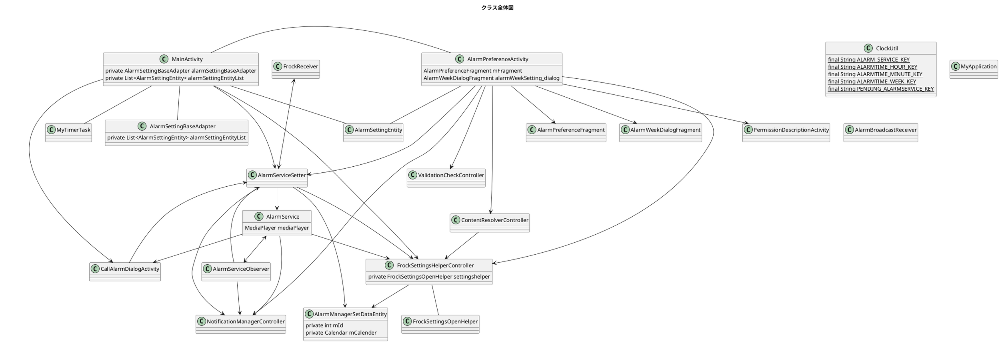
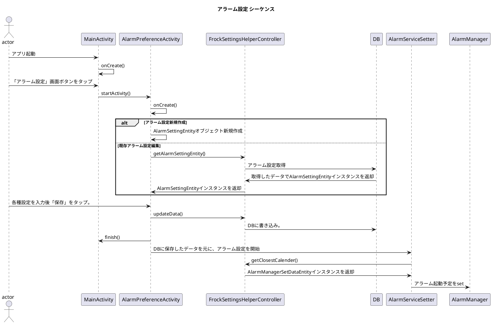

# Configuration #

## 画面一覧
* ホーム画面
* アラーム設定画面

## 機能一覧
* アラーム設定機能
    * 【アラーム設定生成】ユーザー入力情報からアラーム設定を生成する機能
    *  【アラーム設定永続化】アラーム設定作成機能
        * アラーム設定新規追加
            * DBへのアクセス
            * DBへの書き込み
            * UI反映
        * 編集
        * 削除
* アラーム実行機能
    * 音楽再生
    * スヌーズ機能
    * 通知機能

## 全体クラス図



## 内部設計

### アラーム設定機能

#### シーケンス



### アラーム実行機能

#### シーケンス

```puml

```
